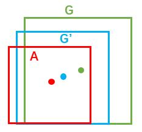
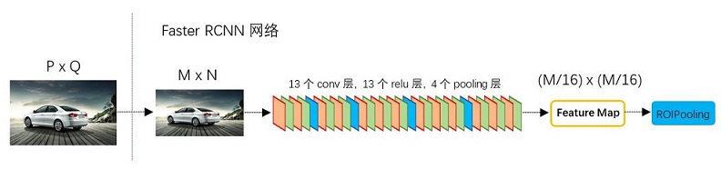

# 目标检测

## Faster RCNN based

### RCNN

RCNN（Region with CNN feature），算法可以分为三步：（1）候选区域选择；（2）CNN特征提取；（3）分类与边界回归。

（1）**候选区域选择**：区域建议Region Proposal是一种传统的区域提取方法Selective Search（SS），SS是一种基于启发式的区域提取方法，查看现有的小区域，合并两个最有可能的区域，重复此步骤，直到图像合并为一个区域，最后输出候选区域。优先合并以下四种区域： 颜色（颜色直方图）相近的； 纹理（梯度直方图）相近的； 合并后总面积小的。最后，所有已经存在的区域都被输出，并生成候选区域。

（2）**CNN特征提取**：标准卷积神经网络根据输入执行诸如卷积或池化的操作以获得固定维度输出。

（3）**分类与边界回归**：分为两个子步骤，一个是对前一步的输出向量进行分类; 二是通过边界回归框回归（缩写为bbox）获得精确的区域信息。在分类器的选择中有支持向量机SVM，Softmax等等；边界回归有bbox回归，多任务损失函数边框回归等 。


<center><font size=2>图0 RCNN</font></center>
缺点：

1. 需要事先提取多个候选区域对应的图像
2. 输入的map需要时固定尺寸的，而归一化过程中对图片产生的形变会导致图片大小改变
3. 每个region proposal都需要进入CNN网络计算


### Fast RCNN

工作流程：

1. 选择性搜索Selective Search（SS）在图片中获得大约2k个候选框。
2. 使用卷积网络提取图片特征。
3. 在第二步进行的卷积操作过后可以得到feature map，根据之前RoI框选择出对应的区域（既可以理解为将feature map映射回原图像）， 在最后一次卷积之前，使用 RoI池层来统一相同的比例（这里利用的是单层SPP-Net）。


<center><font size=2>图1 Fast RCNN</font></center>
**划重点：**

R-CNN有一些相当大的缺点，把这些缺点都改掉了，就成了Fast R-CNN。

大缺点：由于每一个候选框都要独自经过CNN，这使得花费的时间非常多。

解决：共享卷积层，现在不是每一个候选框都当做输入进入CNN了，而是输入一张完整的图片，在第五个卷积层再得到每个候选框的特征

原来的方法：许多候选框（比如两千个）-->CNN-->得到每个候选框的特征-->分类+回归

现在的方法：一张完整图片-->CNN-->得到每张候选框的特征-->分类+回归

所以容易看见，Fast R-CNN相对于R-CNN的提速原因就在于：不过不像R-CNN把每个候选区域给深度网络提特征，而是整张图提一次特征，再把候选框映射到conv5上，而SPP只需要计算一次特征，剩下的只需要在conv5层上操作就可以了。

缺点：

存在瓶颈：选择性搜索，找出所有的候选框，这个也非常耗时。


### Faster RCNN

解决Fast R-CNN选择性搜索的缺点：加入一个提取边缘的神经网络，也就说找到候选框的工作也交给神经网络来做了。因此，在Fast R-CNN中引入Region Proposal Network(RPN)替代Selective Search，同时引入anchor box应对目标形状的变化问题（anchor就是位置和大小固定的box，可以理解成事先设置好的固定的proposal）。

**具体做法：**

- 将RPN放在最后一个卷积层的后面
- RPN直接训练得到候选区域

**主要内容：**

1. Conv layers。作为一种CNN网络目标检测方法，Faster RCNN首先使用一组基础的conv+relu+pooling层提取image的feature maps。该feature maps被共享用于后续RPN层和全连接层。
2. Region Proposal Networks。RPN网络用于生成region proposals。该层通过softmax判断anchors属于foreground或者background，再利用bounding box regression修正anchors获得精确的proposals。
3. Roi Pooling。该层收集输入的feature maps和proposals，综合这些信息后提取proposal feature maps，送入后续全连接层判定目标类别。
4. Classification。利用proposal feature maps计算proposal的类别，同时再次bounding box regression获得检测框最终的精确位置。

 

<center><font size=2>图2 Faster RCNN VGG16</font></center>
上图2展示了python版本中的VGG16模型中的faster_rcnn_test.pt的网络结构，可以清晰的看到该网络对于一副任意大小PxQ的图像，首先缩放至固定大小MxN，然后将MxN图像送入网络；而Conv layers中包含了13个conv层+13个relu层+4个pooling层；RPN网络首先经过3x3卷积，再分别生成foreground anchors与bounding box regression偏移量，然后计算出proposals；而Roi Pooling层则利用proposals从feature maps中提取proposal feature送入后续全连接和softmax网络作classification（即分类proposal到底是什么object）。

#### 1. Conv layers

Conv layers包含了conv，pooling，relu三种层。以python版本中的VGG16模型中的faster_rcnn_test.pt的网络结构为例，如图2，**Conv layers部分共有13个conv层，13个relu层，4个pooling层**。这里有一个非常容易被忽略但是又无比重要的信息，在Conv layers中：

1. 所有的conv层都是：kernel_size=3，pad=1
2. 所有的pooling层都是：kernel_size=2，stride=2

为何重要？在Faster RCNN Conv layers中对所有的卷积都做了扩边处理（pad=1，即填充一圈0），导致原图变为(M+2)x(N+2)大小，再做3x3卷积后输出MxN。正是这种设置，导致Conv layers中的conv层不改变输入和输出矩阵大小。如图3：


<center><font size=2>图3 conv layers</font></center>
类似的是，Conv layers中的pooling层kernel_size=2，stride=2。这样每个经过pooling层的MxN矩阵，都会变为(M/2)*(N/2)大小。综上所述，在整个Conv layers中，conv和relu层不改变输入输出大小，只有pooling层使输出长宽都变为输入的1/2。

那么，**一个MxN大小的矩阵经过Conv layers固定变为(M/16)x(N/16)！**这样Conv layers生成的featuure map中都可以和原图对应起来。

**RPN简介：**

- 在feature map上滑动窗口
- 建一个神经网络用于物体分类+框位置的回归
- 滑动窗口的位置提供了物体的大体位置信息
- 框的回归提供了框更精确的位置

**一种网络，四个损失函数**

- RPN calssification(anchor good.bad)
- RPN regression(anchor->propoasal)
- Fast R-CNN classification(over classes)
- Fast R-CNN regression(proposal ->box)

#### 2. Region Proposal Networks(RPN)

经典的检测方法生成检测框都非常耗时，如OpenCV adaboost使用滑动窗口+图像金字塔生成检测框；或如RCNN使用SS(Selective Search)方法生成检测框。而Faster RCNN则抛弃了传统的滑动窗口和SS方法，直接使用RPN生成检测框，这也是Faster RCNN的巨大优势，能极大提升检测框的生成速度。


<center><font size=2>图5 RPN网络结构</font></center>
上图5展示了RPN网络的具体结构。可以看到RPN网络实际分为2条线，上面一条通过softmax分类anchors获得foreground和background（检测目标是foreground），下面一条用于计算对于anchors的bounding box regression偏移量，以获得精确的proposal。而最后的Proposal层则负责综合foreground anchors和bounding box regression偏移量获取proposals，同时剔除太小和超出边界的proposals。

其实整个网络到了Proposal Layer这里，就完成了相当于目标定位的功能。

##### 2.1 多通道图像卷积基础知识介绍

对于多通道图像+多卷积核做卷积，计算方式如下：


<center><font size=2>图5 多通道+多卷积核做卷积示意图</font></center>
如图5，输入图像layer m-1有4个通道，同时有2个卷积核w1和w2。对于卷积核w1，先在输入图像4个通道分别作卷积，再将4个通道结果加起来得到w1的卷积输出；卷积核w2类似。所以对于某个卷积层，无论输入图像有多少个通道，输出图像通道数总是等于卷积核数量！

<font color=red>对多通道图像做1x1卷积，其实就是将输入图像于每个通道乘以卷积系数后加在一起，即相当于把原图像中本来各个独立的通道“联通”在了一起。</font>

##### 2.2 anchors

提到RPN网络，就不能不说anchors。所谓anchors，实际上就是一组由rpn/generate_anchors.py生成的矩形。直接运行作者demo中的generate_anchors.py可以得到以下输出：

```python
[[ -84.  -40.   99.   55.]
 [-176.  -88.  191.  103.]
 [-360. -184.  375.  199.]
 [ -56.  -56.   71.   71.]
 [-120. -120.  135.  135.]
 [-248. -248.  263.  263.]
 [ -36.  -80.   51.   95.]
 [ -80. -168.   95.  183.]
 [-168. -344.  183.  359.]]
```

其中每行的4个值[x1,y1,x2,y2]代表矩形左上和右下角点坐标。9个矩形共有3种形状，长宽比为大约为：width:height = [1:1, 1:2, 2:1]三种，如图6。实际上通过anchors就引入了检测中常用到的多尺度方法。


<center><font size=2>图6 anchors示意图</font></center>
<font color=green>注：关于上面的anchors size，其实是根据检测图像设置的。在python demo中，会把任意大小的输入图像reshape成800x600（即图2中的M=800，N=600）。再回头来看anchors的大小，anchors中长宽1:2中最大为352x704，长宽2:1中最大736x384，基本是cover了800x600的各个尺度和形状。</font>

那么这9个anchors是做什么的呢？借用Faster RCNN论文中的原图，如图7，遍历Conv layers计算获得的feature maps，为每一个点都配备这9种anchors作为初始的检测框。

<font color=red>这样做获得检测框很不准确，不用担心，后面还有2次bounding box regression可以修正检测框位置。</font>


<center><font size=2>图7 生成初始检测框</font></center>
解释一下上面这张图的数字。

1. 在原文中使用的是ZF model中，其Conv Layers中最后的conv5层num_output=256，对应生成256张特征图，所以相当于feature map每个点都是256-d
2. 在conv5之后，做了rpn_conv/3x3卷积且num_output=256，相当于每个点又融合了周围3x3的空间信息，同时256-d不变
3. 假设在conv5 feature map中每个点上有**k**个anchor（默认k=9），而每个anhcor要分foreground和background，所以每个点由256d feature转化为cls=2k scores；而每个anchor都有[x, y, w, h]对应4个偏移量，所以reg=4k coordinates
4. 补充一点，全部anchors拿去训练太多了，训练程序会在合适的anchors中**随机**选取128个postive anchors+128个negative anchors进行训练

##### 2.3 softmax判定foreground与background

一副MxN大小的矩阵送入Faster RCNN网络后，到RPN网络变为(M/16)x(N/16)，不妨设W=M/16，H=N/16。在进入reshape与softmax之前，先做了1x1卷积，如图8：


<center><font size=2>图8 RPN中判定fg/bg网络结构</font></center>
该1x1卷积的caffe prototxt定义如下：

```cpp
layer {
  name: "rpn_cls_score"
  type: "Convolution"
  bottom: "rpn/output"
  top: "rpn_cls_score"
  convolution_param {
    num_output: 18   # 2(bg/fg) * 9(anchors)
    kernel_size: 1 pad: 0 stride: 1
  }
}
```

可以看到其num_output=18，也就是经过该卷积的输出图像为WxHx18大小。这也就刚好对应了feature maps每一个点都有9个anchors，同时每个anchors又有可能是foreground和background，所有这些信息都保存WxHx(9x2)大小的矩阵。<font color=red>为何这样做？后面接softmax分类获得foreground anchors，也就相当于初步提取了检测目标候选区域box（一般认为目标在foreground anchors中）。</font>

那么为何要在softmax前后都接一个reshape layer？其实只是为了便于softmax分类，至于具体原因这就要从caffe的实现形式说起了。在caffe基本数据结构blob中以如下形式保存数据：

**blob=[batch_size, channel，height，width]**

对应至上面的保存bg/fg anchors的矩阵，其在caffe blob中的存储形式为[1, 2\*9, H, W]。而在softmax分类时需要进行fg/bg二分类，所以reshape layer会将其变为[1, 2, 9*H, W]大小，即单独“腾空”出来一个维度以便softmax分类，之后再reshape回复原状。贴一段caffe softmax_loss_layer.cpp的reshape函数的解释，非常精辟：

```cpp
"Number of labels must match number of predictions; "
"e.g., if softmax axis == 1 and prediction shape is (N, C, H, W), "
"label count (number of labels) must be N*H*W, "
"with integer values in {0, 1, ..., C-1}.";
```

综上所述，RPN网络中利用anchors和softmax初步提取出foreground anchors作为候选区域。

##### 2.4 bounding box regression原理

介绍bounding box regression数学模型及原理。如图9所示绿色框为飞机的Ground Truth(GT)，红色为提取的foreground anchors，那么即便红色的框被分类器识别为飞机，但是由于红色的框定位不准，这张图相当于没有正确的检测出飞机。所以我们希望采用一种方法对红色的框进行微调，使得foreground anchors和GT更加接近。


<center><font size=2>图9</font></center>
对于窗口一般使用四维向量(x, y, w, h)表示，分别表示窗口的中心点坐标和宽高。对于图 10，<font color=red>红色的框A代表原始的Foreground Anchors</font>，<font color=green>绿色的框G代表目标的GT</font>，我们的目标是寻找一种关系，使得输入原始的anchor A经过映射得到一个跟真实窗口G更接近的回归窗口G'，即：给定anchor A=(Ax, Ay, Aw, Ah)，GT=[Gx, Gy, Gw, Gh]，寻找一种变换**F**：使得**F**(Ax, Ay, Aw, Ah)=(G'x, G'y, G'w, G'h)，其中(G'x, G'y, G'w, G'h)≈(Gx, Gy, Gw, Gh)。



<center><font size=2>图10</font></center>
那么经过何种变换**F**才能从图10中的anchor A变为G'呢？ 比较简单的思路就是:

- 先做平移

$$
G'_x=A_w*d_x(A) + A_x
$$

$$
G'_y=A_h*d_y(A) + A_y
$$

- 再做缩放

$$
G'_w=A_w*exp(d_w(A))
$$

$$
G'_h=A_h*exp(d_h(A))
$$

观察上面4个公式发现，需要学习的是$d_x(A)$，$d_y(A)$，$d_w(A)$，$d_h(A)$这四个变换。当输入的anchor A与GT相差较小时，可以认为这种变换是一种线性变换， 那么就可以用线性回归来建模对窗口进行微调（注意，只有当anchors A和GT比较接近时，才能使用线性回归模型，否则就是复杂的非线性问题了）。对应于Faster RCNN原文，平移量$(t_x, t_y)$与尺度因子$(t_w, t_h)$如下：

$$
t_x=(x-x_a)/w_a, \qquad t_y=(y-y_a)/h_a,\\t_w=log(w/w_a), \qquad t_h=log(h/h_a),
$$
接下来的问题就是如何通过线性回归获得$d_x(A)，d_y(A)，d_w(A)，d_h(A)$了。线性回归就是给定输入的特征向量$X$, 学习一组参数$W$，使得经过线性回归后的值跟真实值$Y$非常接近，即$Y=WX$。对于该问题，输入$X$是一张经过卷积获得的feature map，定义为$\phi$；同时还有训练传入的GT，即$(t_x, t_y, t_w, t_h)$。输出是$d_x(A)$，$d_y(A)$，$d_w(A)$，$d_h(A)$ 四个变换。那么目标函数可以表示为：
$$
d_*(A)=w^T_*\cdot\phi(A)
$$
其中$\phi(A)$是对应anchor的feature map组成的特征向量，w$$是需要学习的参数，$d(A)$是得到的预测值（*表示 x，y，w，h，也就是每一个变换对应一个上述目标函数）。为了让预测值$(t_x, t_y, t_w, t_h)$与真实值差距最小，设计损失函数：
$$
Loss=\sum^N_i(t^i_*-\bar w^T_*(A^i))^2
$$
函数优化目标为：
$$
w_*=\arg\min_{\bar w_*}\sum^N_i(t^i_*-\bar w^T_*\cdot\phi(A^i))^2 + \lambda \| \bar w_*\|^2
$$

##### 2.5 对proposals进行bounding box regression

缩进在了解bounding box regression后，再回头来看RPN网络第二条线路，如图11。


<center><font size=2>图11 RPN中的bbox reg</font></center>
先来看一看上图11中1x1卷积的caffe prototxt定义：

```cpp
layer {
  name: "rpn_bbox_pred"
  type: "Convolution"
  bottom: "rpn/output"
  top: "rpn_bbox_pred"
  convolution_param {
    num_output: 36   # 4 * 9(anchors)
    kernel_size: 1 pad: 0 stride: 1
  }
}
```

可以看到其num_output=36，即经过该卷积输出图像为WxHx36，在caffe blob存储为[1, 36, H, W]，这里相当于feature maps每个点都有9个anchors，每个anchors又都有4个用于回归的$[d_x(A)，d_y(A)，d_w(A)，d_h(A)]$变换量。

##### 2.6 Proposal Layer

缩进Proposal Layer负责综合所有$[d_x(A)，d_y(A)，d_w(A)，d_h(A)]$变换量和foreground anchors，计算出精准的proposal，送入后续RoI Pooling Layer。还是先来看看Proposal Layer的caffe prototxt定义：

```cpp
layer {
  name: 'proposal'
  type: 'Python'
  bottom: 'rpn_cls_prob_reshape'
  bottom: 'rpn_bbox_pred'
  bottom: 'im_info'
  top: 'rois'
  python_param {
    module: 'rpn.proposal_layer'
    layer: 'ProposalLayer'
    param_str: "'feat_stride': 16"
  }
}
```

Proposal Layer有3个输入：fg/bg anchors分类器结果rpn_cls_prob_reshape，对应的bbox reg的$[d_x(A)，d_y(A)，d_w(A)，d_h(A)]$变换量rpn_bbox_pred，以及im_info；另外还有参数feat_stride=16。

首先解释im_info。对于一副任意大小PxQ图像，传入Faster RCNN前首先reshape到固定MxN，im_info=[M, N, scale_factor]则保存了此次缩放的所有信息。然后经过Conv Layers，经过4次pooling变为WxH=(M/16)x(N/16)大小，其中feature_stride=16则保存了该信息，用于计算anchor偏移量。



<center><font size=2>图12</font></center>
Proposal Layer forward（caffe layer的前传函数）按照以下顺序依次处理：

1. 生成anchors，利用$[d_x(A)，d_y(A)，d_w(A)，d_h(A)]$对所有的anchors做bbox regression回归（这里的anchors生成和训练时完全一致）
2. 按照输入的foreground softmax scores由大到小排序anchors，提取前pre_nms_topN(e.g. 6000)个anchors，即提取修正位置后的foreground anchors。
3. 利用im_info将fg anchors从MxN尺度映射回PxQ原图，判断fg anchors是否大范围超过边界，剔除严重超出边界fg anchors。
4. 进行nms（nonmaximum suppression，非极大值抑制）
5. 再次按照nms后的foreground softmax scores由大到小排序fg anchors，提取前post_nms_topN(e.g. 300)结果作为proposal输出。

之后输出$proposal=[x_1, y_1, x_2, y_2]$，<font color=red>注意，由于在第三步中将anchors映射回原图判断是否超出边界，所以这里输出的proposal是对应MxN输入图像尺度的，</font>这点在后续网络中有用。另外我认为，严格意义上的检测应该到此就结束了，后续部分应该属于识别了~

RPN网络结构就介绍到这里，总结起来就是：

<font color=red>**生成anchors -> softmax分类器提取fg anchors -> bbox reg回归fg anchors -> Proposal Layer生成proposals**</font>


#### 3 RoI pooling 

RoI Pooling层则负责收集proposal，并计算出proposal feature maps，送入后续网络。从图3中可以看到Rol pooling层有2个输入：

1. 原始的feature maps
2. RPN输出的proposal boxes（大小各不相同）

##### 3.1 为何需要RoI Pooling

缩进先来看一个问题：对于传统的CNN（如AlexNet，VGG），当网络训练好后输入的图像尺寸必须是固定值，同时网络输出也是固定大小的vector or matrix。如果输入图像大小不定，这个问题就变得比较麻烦。有2种解决办法：

1. 从图像中crop一部分传入网络
2. 将图像warp成需要的大小后传入网络


<center><font size=2>图13 crop与warp破坏图像原有结构信息</font></center>
两种办法的示意图如图13，可以看到无论采取那种办法都不好，要么crop后破坏了图像的完整结构，要么warp破坏了图像原始形状信息。回忆RPN网络生成的proposals的方法：对foreground anchors进行bound box regression，那么这样获得的proposals也是大小形状各不相同，即也存在上述问题。所以Faster RCNN中提出了RoI Pooling解决这个问题（需要说明，RoI Pooling从**SPP**发展而来)

##### 3.2 RoI Pooling原理

缩进分析之前先来看看RoI Pooling Layer的caffe prototxt的定义：

```cpp
layer {
  name: "roi_pool5"
  type: "ROIPooling"
  bottom: "conv5_3"
  bottom: "rois"
  top: "pool5"
  roi_pooling_param {
    pooled_w: 7
    pooled_h: 7
    spatial_scale: 0.0625 # 1/16
  }
}
```

其中有新参数pooled_w=pooled_h=7，另外一个参数spatial_scale=1/16应该能够猜出大概吧。

缩进RoI Pooling layer forward过程：在之前有明确提到：$proposal=[x_1, y_1, x_2, y_2]$是对应MxN尺度的，所以首先使用spatial_scale参数将其映射回(M/16)x(N/16)大小的feature maps尺度（这里来回多次映射，是有点绕）；之后将每个proposal水平和竖直都分为7份，对每一份都进行max pooling处理。这样处理后，即使大小不同的proposal，输出结果都是7x7大小，实现了fixed-length output（固定长度输出）。


<center><font size=2>图14 proposal示意图</font></center>
#### 4 Classification

缩进Classification部分利用已经获得的proposal feature maps，通过full connect层与softmax计算每个proposal具体属于那个类别（如人，车，电视等），输出cls_prob概率向量；同时再次利用bounding box regression获得每个proposal的位置偏移量bbox_pred，用于回归更加精确的目标检测框。Classification部分网络结构如图15。


<center><font size=2>图15 Classification部分网络结构图</font></center>


从PoI Pooling获取到7x7=49大小的proposal feature maps后，送入后续网络，可以看到做了如下2件事：

1. 通过全连接和softmax对proposals进行分类，这实际上已经是识别的范畴了
2. 再次对proposals进行bounding box regression，获取更高精度的rect box

这里来看看全连接层InnerProduct layers，简单的示意图如图16，


<center><font size=2>图16 全连接层示意图</font></center>
其计算公式如下：
$$
(\matrix{x_1 & x_2 & x_3})\left(\matrix{w_{11}&w_{12}\\w_{21}&w_{22}\\w_{31}&w_{32}}\right) + \left(\matrix{b_1&b_2}\right)=\left(\matrix{y_1&y_2}\right)
$$
其中$W$和bias B都是预先训练好的，即大小是固定的，当然输入X和输出Y也就是固定大小。所以，这也就印证了之前**Roi Pooling的必要性**。


## YOLO baesd

### YOLO V1

#### 1. YOLO 的核心思想

- YOLO 的核心思想就是利用整张图作为网络的输入，直接在输出层回归 bounding box（边界框） 的位置及其所属的类别。
- faster-RCNN 中也直接用整张图作为输入，但是 faster-RCNN 整体还是采用了RCNN 那种 proposal+classifier 的思想，只不过是将提取 proposal 的步骤放在 CNN 中实现了，而 YOLO 则采用直接回归的思路。

#### 2. YOLO 的实现方法

将一幅图像分成 SxS 个网格（grid cell），如果某个 object 的中心落在这个网格中，则这个网格就负责预测这个 object。


每个网格要预测 B 个 bounding box，每个 bounding box 除了要回归自身的位置之外，还要附带预测一个 confidence 值。 这个 confidence 代表了所预测的 box 中含有 object 的置信度和这个 box 预测的有多准这两重信息，其值是这样计算的：  
$$
confidence=Pr(Object) * IOU^{truth}_{pred}
$$
其中如果有 object 落在一个 grid cell 里，第一项取 1，否则取 0。 第二项是预测的 bounding box 和实际的 groundtruth 之间的 IoU 值。

每个 bounding box 要预测$ (x, y, w, h)$ 和$confidence $共5个值，每个网格还要预测一个类别信息，记为 C 类。则 SxS个 网格，每个网格要预测 B 个 bounding box 还要预测 C 个 categories。输出就是$ S * S * (5*B+C) $的一个 tensor。

<font color=red>注意：class 信息是针对每个网格的，confidence 信息是针对每个 bounding box 的。</font>

举例说明: 在 PASCAL VOC 中，图像输入为 448x448，取 S=7，B=2，一共有20 个类别（C=20），则输出就是 $7*7*30$ 的一个 tensor。

整个网络结构如下图所示： 


在 test 的时候，每个网格预测的 class 信息和 bounding box 预测的 confidence信息相乘，就得到每个 bounding box 的 class-specific confidence score:
$$
Pr(Class_i|Object)*Pr(Object) * IOU^{truth}_{pred}=Pr(Class_i) * IOU^{truth}_{pred}
$$
等式左边第一项就是每个网格预测的类别信息，第二、三项就是每个 bounding box 预测的 confidence。这个乘积即 encode 了预测的 box 属于某一类的概率，也有该 box 准确度的信息。

得到每个 box 的 class-specific confidence score 以后，设置阈值，滤掉得分低的 boxes，对保留的 boxes 进行 NMS 处理，就得到最终的检测结果。

> **注：**
>
> 由于输出层为全连接层，因此在检测时，YOLO 训练模型只支持与训练图像相同的输入分辨率。
>
> 虽然每个格子可以预测 B 个 bounding box，但是最终只选择只选择 IOU 最高的 bounding box 作为物体检测输出，即每个格子最多只预测出一个物体。当物体占画面比例较小，如图像中包含畜群或鸟群时，每个格子包含多个物体，但却只能检测出其中一个。这是 YOLO 方法的一个缺陷。

#### 3. YOLO 的实现细节

每个 grid 有 30 维，这 30 维中，8 维是回归 box 的坐标，2 维是 box的 confidence，还有 20 维是类别。 

其中坐标的 x, y 用对应网格的 offset 归一化到 0-1 之间，w, h 用图像的 width 和 height 归一化到 0-1 之间。

在实现中，最主要的就是怎么设计损失函数，让这个三个方面得到很好的平衡。作者简单粗暴的全部采用了 sum-squared error loss 来做这件事。

这种做法存在以下几个问题： 

- 第一，8维的 localization error 和20维的 classification error 同等重要显然是不合理的； 
- 第二，如果一个网格中没有 object（一幅图中这种网格很多），那么就会将这些网格中的 box 的 confidence push 到 0，相比于较少的有 object 的网格，这种做法是 overpowering 的，这会导致网络不稳定甚至发散。

解决办法：

- 更重视8维的坐标预测，给这些损失前面赋予更大的 loss weight, 记为在 pascal VOC 训练中取 5。
- 对没有 object 的 box 的 confidence loss，赋予小的 loss weight，记为在 pascal VOC 训练中取 0.5。
- 有 object 的 box 的 confidence loss 和类别的 loss 的 loss weight 正常取 1。
- 对不同大小的 box 预测中，相比于大 box 预测偏一点，小 box 预测偏一点肯定更不能被忍受的。而 sum-square error loss 中对同样的偏移 loss 是一样。
- 为了缓和这个问题，作者用了一个比较取巧的办法，就是将 box 的 width 和 height 取平方根代替原本的 height 和 width。这个参考下面的图很容易理解，小box 的横轴值较小，发生偏移时，反应到y轴上相比大 box 要大。（也是个近似逼近方式）


一个网格预测多个 box，希望的是每个 box predictor 专门负责预测某个 object。具体做法就是看当前预测的 box 与 ground truth box 中哪个 IoU 大，就负责哪个。这种做法称作 box predictor 的 specialization。

最后整个的损失函数如下所示： 


这个损失函数中： 

- 只有当某个网格中有 object 的时候才对 classification error 进行惩罚。
- 只有当某个 box predictor 对某个 ground truth box 负责的时候，才会对 box 的 coordinate error 进行惩罚，而对哪个 ground truth box 负责就看其预测值和 ground truth box 的 IoU 是不是在那个 cell 的所有 box 中最大。

> 注：
>
> YOLO 方法模型训练依赖于物体识别标注数据，因此，对于非常规的物体形状或比例，YOLO 的检测效果并不理想。
>
> YOLO 采用了多个下采样层，网络学到的物体特征并不精细，因此也会影响检测效果。
>
> YOLO 的损失函数中，大物体 IOU 误差和小物体 IOU 误差对网络训练中 loss 贡献值接近（虽然采用求平方根方式，但没有根本解决问题）。因此，对于小物体，小的 IOU 误差也会对网络优化过程造成很大的影响，从而降低了物体检测的定位准确性。

#### 4. YOLO 的缺点

YOLO 对相互靠的很近的物体，还有很小的群体检测效果不好，这是因为一个网格中只预测了两个框，并且只属于一类。

同一类物体出现的新的不常见的长宽比和其他情况时，泛化能力偏弱。

由于损失函数的问题，定位误差是影响检测效果的主要原因。尤其是大小物体的处理上，还有待加强。

### YOLO V2

#### 1. 更准

YOLO 一代有很多缺点，作者希望改进的方向是改善 recall，提升定位的准确度，同时保持分类的准确度。 
目前计算机视觉的趋势是更大更深的网络，更好的性能表现通常依赖于训练更大的网络或者把多种模型综合到一起。但是 YOLO v2 则着力于简化网络。具体的改进见下表：


**Batch Normalization**

使用 Batch Normalization 对网络进行优化，让网络提高了收敛性，同时还消除了对其他形式的正则化（regularization）的依赖。通过对 YOLO 的每一个卷积层增加 Batch Normalization，最终使得 mAP 提高了 2%，同时还使模型正则化。使用 Batch Normalization 可以从模型中去掉 Dropout，而不会产生过拟合。

**High resolution classifier**

目前业界标准的检测方法，都要先把分类器（classifier）放在ImageNet上进行预训练。从 Alexnet 开始，大多数的分类器都运行在小于$ 256*256$ 的图片上。而现在 YOLO 从 $224*224$ 增加到了 $448*448$，这就意味着网络需要适应新的输入分辨率。

为了适应新的分辨率，YOLO v2 的分类网络以 $448*448$ 的分辨率先在 ImageNet上进行微调，微调 10 个 epochs，让网络有时间调整滤波器（filters），好让其能更好的运行在新分辨率上，还需要调优用于检测的 Resulting Network。最终通过使用高分辨率，mAP 提升了 4%。

**Convolution with anchor boxes**

YOLO 一代包含有全连接层，从而能直接预测 Bounding Boxes 的坐标值。  Faster R-CNN 的方法只用卷积层与 Region Proposal Network 来预测 Anchor Box 偏移值与置信度，而不是直接预测坐标值。作者发现通过预测偏移量而不是坐标值能够简化问题，让神经网络学习起来更容易。

所以最终 YOLO 去掉了全连接层，使用 Anchor Boxes 来预测 Bounding Boxes。作者去掉了网络中一个池化层，这让卷积层的输出能有更高的分辨率。收缩网络让其运行在 $416*416$ 而不是 $448*448$。由于图片中的物体都倾向于出现在图片的中心位置，特别是那种比较大的物体，所以有一个单独位于物体中心的位置用于预测这些物体。YOLO 的卷积层采用 32 这个值来下采样图片，所以通过选择  用$416*416$ 作输入尺寸最终能输出一个 $13*13 $的特征图。 使用 Anchor Box 会让精确度稍微下降，但用了它能让 YOLO 能预测出大于一千个框，同时 recall 达到88%，mAP 达到 69.2%。

**Dimension clusters**

之前 Anchor Box 的尺寸是手动选择的，所以尺寸还有优化的余地。 为了优化，在训练集的 Bounding Boxes 上跑一下 k-means聚类，来找到一个比较好的值。

如果我们用标准的欧式距离的 k-means，尺寸大的框比小框产生更多的错误。因为我们的目的是提高 IOU 分数，这依赖于 Box 的大小，所以距离度量的使用： 
$$
d(box,centroid)=1-IOU(box,centroid)
$$


通过分析实验结果（Figure 2），左图：在模型复杂性与 high recall 之间权衡之后，选择聚类分类数 K=5。右图：是聚类的中心，大多数是高瘦的 Box。

Table1 是说明用 K-means 选择 Anchor Boxes 时，当 Cluster IOU 选择值为 5 时，AVG IOU 的值是 61，这个值要比不用聚类的方法的 60.9 要高。选择值为 9 的时候，AVG IOU 更有显著提高。总之就是说明用聚类的方法是有效果的。

**Direct location prediction**

用 Anchor Box 的方法，会让 model 变得不稳定，尤其是在最开始的几次迭代的时候。大多数不稳定因素产生自预测 Box 的（x,y）位置的时候。按照之前 YOLO的方法，网络不会预测偏移量，而是根据 YOLO 中的网格单元的位置来预测坐标，这就让 Ground Truth 的值介于 0 到 1 之间。而为了让网络的结果能落在这一范围内，网络使用一个 Logistic Activation 来对于网络预测结果进行限制，让结果介于 0 到 1 之间。 网络在每一个网格单元中预测出 5 个 Bounding Boxes，每个 Bounding Boxes 有五个坐标值 tx，ty，tw，th，t0，他们的关系见下图（Figure3）。假设一个网格单元对于图片左上角的偏移量是 cx、cy，Bounding Boxes Prior 的宽度和高度是 pw、ph，那么预测的结果见下图右面的公式： 


因为使用了限制让数值变得参数化，也让网络更容易学习、更稳定。Dimension clusters和Direct location prediction，使 YOLO 比其他使用 Anchor Box 的版本提高了近5％。

**Fine-Grained Features**

YOLO 修改后的特征图大小为 $13*13$，这个尺寸对检测图片中尺寸大物体来说足够了，同时使用这种细粒度的特征对定位小物体的位置可能也有好处。Faster-RCNN、SSD 都使用不同尺寸的特征图来取得不同范围的分辨率，而 YOLO 采取了不同的方法，YOLO 加上了一个 Passthrough Layer 来取得之前的某个 $26*26$ 分辨率的层的特征。这个 Passthrough layer 能够把高分辨率特征与低分辨率特征联系在一起，联系起来的方法是把相邻的特征堆积在不同的 Channel 之中，这一方法类似与 Resnet 的 Identity Mapping，从而把 $26*26*512$ 变成 $13*13*2048$。YOLO 中的检测器位于扩展后（expanded ）的特征图的上方，所以他能取得细粒度的特征信息，这提升了 YOLO 1% 的性能。

**Multi-Scale Training**

作者希望 YOLOv2 能健壮地运行于不同尺寸的图片之上，所以把这一想法用于训练模型中。 

区别于之前的补全图片的尺寸的方法，YOLOv2 每迭代几次都会改变网络参数。每 10 个 Batch，网络会随机地选择一个新的图片尺寸，由于使用了下采样参数是  32，所以不同的尺寸大小也选择为 32 的倍数 {320，352…..608}，最小$ 320*320$，最大 $608*608$，网络会自动改变尺寸，并继续训练的过程。

这一政策让网络在不同的输入尺寸上都能达到一个很好的预测效果，同一网络能在不同分辨率上进行检测。当输入图片尺寸比较小的时候跑的比较快，输入图片尺寸比较大的时候精度高，所以你可以在 YOLOv2 的速度和精度上进行权衡。

#### 2. 更快

YOLO 使用的是 GoogLeNet 架构，比 VGG-16 快，YOLO 完成一次前向过程只用 85.2 亿次运算，而 VGG-16 要 306.9 亿次，但是 YOLO 精度稍低于 VGG-16。

**Draknet19**

YOLO v2 基于一个新的分类模型，有点类似于 VGG。YOLO v2 使用 $3*3$ 的 filter，每次池化之后都增加一倍 Channels 的数量。YOLO v2 使用全局平均池化，使用 Batch Normilazation 来让训练更稳定，加速收敛，使模型规范化。

最终的模型–Darknet19，有 19 个卷积层和 5 个 maxpooling 层，处理一张图片只需要 55.8 亿次运算，在 ImageNet 上达到 72.9% top-1 精确度，91.2% top-5 精确度。

**Training for classification**

在训练时，把整个网络在更大的$448*448$分辨率上Fine Turnning 10个 epoches，初始学习率设置为0.001，这种网络达到达到76.5%top-1精确度，93.3%top-5精确度。

#### 3. 更强

在训练的过程中，当网络遇到一个来自检测数据集的图片与标记信息，那么就把这些数据用完整的 YOLO v2 loss 功能反向传播这个图片。当网络遇到一个来自分类数据集的图片和分类标记信息，只用整个结构中分类部分的 loss 功能反向传播这个图片。

但是检测数据集只有粗粒度的标记信息，像“猫“、“ 狗”之类，而分类数据集的标签信息则更细粒度，更丰富。比如狗这一类就包括”哈士奇“、”牛头梗“、”金毛狗“等等。所以如果想同时在监测数据集与分类数据集上进行训练，那么就要用一种一致性的方法融合这些标签信息。

再者，用于分类的方法，大多是用 softmax layer 方法，softmax 意味着分类的类别之间要互相独立的。而盲目地混合数据集训练，就会出现比如：检测数据集的分类信息中”狗“这一分类，在分类数据集合中，就会有的不同种类的狗：“哈士奇”、“牛头梗”、“金毛”这些分类，这两种数据集之间的分类信息不相互独立。所以使用一种多标签的模型来混合数据集，假设一个图片可以有多个分类信息，并假定分类信息必须是相互独立的规则可以被忽略。

**Hierarchical classification**

WordNet 的结构是一个直接图表（directed graph），而不是树型结构。因为语言是复杂的，狗这个词既属于”犬科“又属于”家畜“两类，而”犬科“和”家畜“两类在 WordNet 中则是同义词，所以不能用树形结构。

作者希望根据 ImageNet 中包含的概念来建立一个分层树，为了建立这个分层树，首先检查 ImagenNet 中出现的名词，再在 WordNet 中找到这些名词，再找到这些名词到达他们根节点的路径（在这里设为所有的根节点为实体对象（physical object）。在 WordNet 中，大多数同义词只有一个路径，所以首先把这条路径中的词全部都加到分层树中。接着迭代地检查剩下的名词，并尽可能少的把他们添加到分层树上，添加的原则是取最短路径加入到树中。

为了计算某一结点的绝对概率，只需要对这一结点到根节点的整条路径的所有概率进行相乘。所以比如你想知道一个图片是否是 Norfolk terrier 的概率，则进行如下计算：
$$
Pr(Norfolk\ terrier)=Pr(Norfolk\ terrier|terrier)\\*Pr(terrier|hunting\ dog)\\*...*\\*Pr(mammal|animal)\\*Pr(animal|physical\ object)
$$
为了验证这一个方法，在 WordTree 上训练 Darknet19 的模型，使用 1000 类的 ImageNet 进行训练，为了建立 WordtTree 1K，把所有中间词汇加入到 WordTree 上，把标签空间从 1000 扩大到了 1369。在训练过程中，如果有一个图片的标签是“Norfolk terrier”，那么这个图片还会获得”狗“（dog）以及“哺乳动物”（mammal）等标签。总之现在一张图片是多标记的，标记之间不需要相互独立。


如 Figure5 所示，之前的 ImageNet 分类是使用一个大 softmax 进行分类。而现在，WordTree 只需要对同一概念下的同义词进行 softmax 分类。 

使用相同的训练参数，这种分层结构的Darknet19达到71.9%top-1精度和90.4% top-5 精确度，精度只有微小的下降。 

这种方法的好处：在对未知或者新的物体进行分类时，性能降低的很优雅（gracefully）。比如看到一个狗的照片，但不知道是哪种种类的狗，那么就高置信度（confidence）预测是”狗“，而其他狗的种类的同义词如”哈士奇“、”牛头梗“、”金毛“等这些则低置信度。

**Datasets combination with wordtree**

用 WordTree 把数据集合中的类别映射到分层树中的同义词上，例如上图 Figure 6，WordTree 混合 ImageNet 与 COCO。

**Joint classfication and detection**

作者的目的是：训练一个 Extremely Large Scale 检测器。所以训练的时候使用 WordTree 混合了 COCO 检测数据集与 ImageNet 中的 Top9000 类，混合后的数据集对应的 WordTree 有 9418 个类。另一方面，由于 ImageNet 数据集太大了，作者为了平衡一下两个数据集之间的数据量，通过过采样（oversampling） COCO 数据集中的数据，使 COCO 数据集与 ImageNet 数据集之间的数据量比例达到 1：4。

YOLO9000 的训练基于 YOLO v2 的构架，但是使用 3 priors 而不是 5 来限制输出的大小。当网络遇到检测数据集中的图片时则正常地反方向传播，当遇到分类数据集图片的时候，只使用分类的 loss 功能进行反向传播。同时作者假设 IOU 最少为 0.3。最后根据这些假设进行反向传播。

使用联合训练法，YOLO9000 使用 COCO 检测数据集学习检测图片中的物体的位置，使用 ImageNet 分类数据集学习如何对大量的类别中进行分类。 

### YOLO V3

YOLOv3 的先验检测（Prior detection）系统将分类器或定位器重新用于执行检测任务。他们将模型应用于图像的多个位置和尺度。而那些评分较高的区域就可以视为检测结果。此外，相对于其它目标检测方法，我们使用了完全不同的方法。我们将一个单神经网络应用于整张图像，该网络将图像划分为不同的区域，因而预测每一块区域的边界框和概率，这些边界框会通过预测的概率加权。我们的模型相比于基于分类器的系统有一些优势。它在测试时会查看整个图像，所以它的预测利用了图像中的全局信息。与需要数千张单一目标图像的 R-CNN 不同，它通过单一网络评估进行预测。这令 YOLOv3 非常快，一般它比 R-CNN 快 1000 倍、比 Fast R-CNN 快 100 倍。

**改进之处：**

1.多尺度预测 （类FPN）

2.更好的基础分类网络（类ResNet）和分类器 darknet-53，见下图

3.分类器-类别预测：

YOLOv3 不使用 Softmax 对每个框进行分类，主要考虑因素有：

1. Softmax 使得每个框分配一个类别（得分最高的一个），而对于 Open Images这种数据集，目标可能有重叠的类别标签，因此 Softmax不适用于多标签分类。
2. Softmax 可被独立的多个 logistic 分类器替代，且准确率不会下降。 
3. 分类损失采用 binary cross-entropy loss.


**多尺度预测**

每种尺度预测 3 个 box, anchor 的设计方式仍然使用聚类，得到9个聚类中心，将其按照大小均分给 3 个尺度。

- 尺度1: 在基础网络之后添加一些卷积层再输出box信息。
- 尺度2: 从尺度1中的倒数第二层的卷积层上采样(x2)再与最后一个 16x16 大小的特征图相加，再次通过多个卷积后输出 box 信息，相比尺度1变大两倍.
- 尺度3: 与尺度2类似，使用了 32x32 大小的特征图


**基础网络 Darknet-53**


## SSD based


