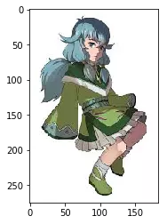
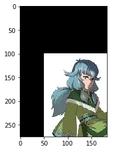
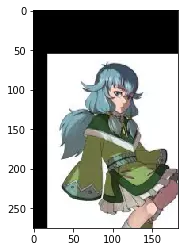
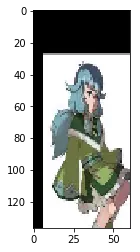
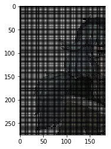
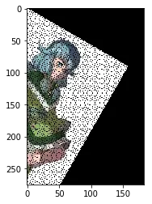
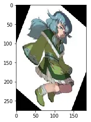
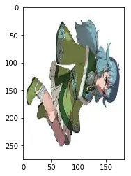
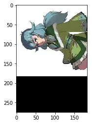
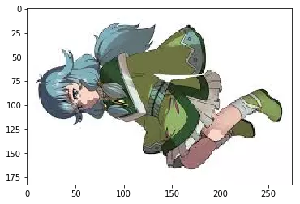

# Pytorch中的仿射变换(affine_grid)

在看 pytorch 的 [Spatial Transformer Network 教程](https://pytorch.org/tutorials/intermediate/spatial_transformer_tutorial.html) 时，在 stn 层中的 `affine_grid` 与 `grid_sample` 函数上卡住了，不知道这两个函数该如何使用，经过一些实验终于搞清楚了其作用。

假设我们有这么一张图片：


下面我们将通过分别通过手动编码和pytorch方式对该图片进行平移、旋转、转置、缩放等操作，这些操作的数学原理在本文中不会详细讲解。

实现载入图片(注意，下面的代码都是在 jupyter 中进行)：

```python
from torchvision import transforms
from PIL import Image
import matplotlib.pyplot as plt

%matplotlib inline

img_path = "图片文件路径"
img_torch = transforms.ToTensor()(Image.open(img_path))

plt.imshow(img_torch.numpy().transpose(1,2,0))
plt.show()
```



## 平移操作

### 普通方式

例如我们需要向右平移50px，向下平移100px。

```python
import numpy as np
import torch

theta = np.array([
    [1,0,50],
    [0,1,100]
])
# 变换1：可以实现缩放/旋转，这里为 [[1,0],[0,1]] 保存图片不变
t1 = theta[:,[0,1]]
# 变换2：可以实现平移
t2 = theta[:,[2]]

_, h, w = img_torch.size()
new_img_torch = torch.zeros_like(img_torch, dtype=torch.float)
for x in range(w):
    for y in range(h):
        pos = np.array([[x], [y]])
        npos = t1@pos+t2
        nx, ny = npos[0][0], npos[1][0]
        if 0<=nx<w and 0<=ny<h:
            new_img_torch[:,ny,nx] = img_torch[:,y,x]
plt.imshow(new_img_torch.numpy().transpose(1,2,0))
plt.show()
```



<center><font size=2>图片平移-1</font></center>

### pytorch 方式

向右移动0.2，向下移动0.4：

```python
from torch.nn import functional as F

theta = torch.tensor([
    [1,0,-0.2],
    [0,1,-0.4]
], dtype=torch.float)
grid = F.affine_grid(theta.unsqueeze(0), img_torch.unsqueeze(0).size())
output = F.grid_sample(img_torch.unsqueeze(0), grid)
new_img_torch = output[0]
plt.imshow(new_img_torch.numpy().transpose(1,2,0))
plt.show()
```

得到的图片为：



<center><font size=2>图片平移-2</font></center>

总结：

- 要使用 pytorch 的平移操作，只需要两步： 
  - 创建 grid：`grid = torch.nn.functional.affine_grid(theta, size)`，其实我们可以通过调节 `size` 设置所得到的图像的大小(相当于resize)；
  - grid_sample 进行重采样：`outputs = torch.nn.functional.grid_sample(inputs, grid, mode='bilinear')` 
- theta 的第三列为平移比例，向右为负，向下为负；

我们通过设置 `size` 可以将图像resize：

```python
from torch.nn import functional as F

theta = torch.tensor([
    [1,0,-0.2],
    [0,1,-0.4]
], dtype=torch.float)
# 修改size
N, C, W, H = img_torch.unsqueeze(0).size()
size = torch.Size((N, C, W//2, H//3))
grid = F.affine_grid(theta.unsqueeze(0), size)
output = F.grid_sample(img_torch.unsqueeze(0), grid)
new_img_torch = output[0]
plt.imshow(new_img_torch.numpy().transpose(1,2,0))
plt.show()
```



<center><font size=2>修改size的效果</font></center>

## 缩放操作

### 普通方式

放大1倍：

```python
import numpy as np
import torch

theta = np.array([
    [2,0,0],
    [0,2,0]
])
t1 = theta[:,[0,1]]
t2 = theta[:,[2]]

_, h, w = img_torch.size()
new_img_torch = torch.zeros_like(img_torch, dtype=torch.float)
for x in range(w):
    for y in range(h):
        pos = np.array([[x], [y]])
        npos = t1@pos+t2
        nx, ny = npos[0][0], npos[1][0]
        if 0<=nx<w and 0<=ny<h:
            new_img_torch[:,ny,nx] = img_torch[:,y,x]
plt.imshow(new_img_torch.numpy().transpose(1,2,0))
plt.show()
```

结果为：



<center><font size=2>放大操作-1</font></center>

由于没有使用插值算法，所以中间有很多部分是黑色的。

### pytorch 方式

```python
from torch.nn import functional as F

theta = torch.tensor([
    [0.5, 0  , 0],
    [0  , 0.5, 0]
], dtype=torch.float)
grid = F.affine_grid(theta.unsqueeze(0), img_torch.unsqueeze(0).size())
output = F.grid_sample(img_torch.unsqueeze(0), grid)
new_img_torch = output[0]
plt.imshow(new_img_torch.numpy().transpose(1,2,0))
plt.show()
```

结果为：


<center><font size=2>放大操作-2</font></center>

 结论：可以看到，affine_grid 的放大操作是以图片中心为原点的。


## 旋转操作

### 普通操作

将图片旋转30度：

```python
import numpy as np
import torch
import math

angle = 30*math.pi/180
theta = np.array([
    [math.cos(angle),math.sin(-angle),0],
    [math.sin(angle),math.cos(angle) ,0]
])
t1 = theta[:,[0,1]]
t2 = theta[:,[2]]

_, h, w = img_torch.size()
new_img_torch = torch.zeros_like(img_torch, dtype=torch.float)
for x in range(w):
    for y in range(h):
        pos = np.array([[x], [y]])
        npos = t1@pos+t2
        nx, ny = int(npos[0][0]), int(npos[1][0])
        if 0<=nx<w and 0<=ny<h:
            new_img_torch[:,ny,nx] = img_torch[:,y,x]
plt.imshow(new_img_torch.numpy().transpose(1,2,0))
plt.show()
```

 结果为：



<center><font size=2>旋转操作-1</font></center>

### pytorch 操作

```python
from torch.nn import functional as F
import math

angle = -30*math.pi/180
theta = torch.tensor([
    [math.cos(angle),math.sin(-angle),0],
    [math.sin(angle),math.cos(angle) ,0]
], dtype=torch.float)
grid = F.affine_grid(theta.unsqueeze(0), img_torch.unsqueeze(0).size())
output = F.grid_sample(img_torch.unsqueeze(0), grid)
new_img_torch = output[0]
plt.imshow(new_img_torch.numpy().transpose(1,2,0))
plt.show()
```

结果为：



<center><font size=2>旋转操作-2</font></center>

pytorch 以图片中心为原点进行旋转，并且在旋转过程中会发生图片缩放，如果选择角度变为 90°，图片为：



<center><font size=2>旋转 90° 结果</font></center>

## 转置操作

### 普通操作

```python
import numpy as np
import torch

theta = np.array([
    [0,1,0],
    [1,0,0]
])
t1 = theta[:,[0,1]]
t2 = theta[:,[2]]

_, h, w = img_torch.size()
new_img_torch = torch.zeros_like(img_torch, dtype=torch.float)
for x in range(w):
    for y in range(h):
        pos = np.array([[x], [y]])
        npos = t1@pos+t2
        nx, ny = npos[0][0], npos[1][0]
        if 0<=nx<w and 0<=ny<h:
            new_img_torch[:,ny,nx] = img_torch[:,y,x]
plt.imshow(new_img_torch.numpy().transpose(1,2,0))
plt.show()
```

结果为：



<center><font size=2>图片转置-1</font></center>

### pytorch 操作

我们可以通过size大小，保存图片不被压缩：

```python
from torch.nn import functional as F

theta = torch.tensor([
    [0, 1, 0],
    [1, 0, 0]
], dtype=torch.float)
N, C, H, W = img_torch.unsqueeze(0).size()
grid = F.affine_grid(theta.unsqueeze(0), torch.Size((N, C, W, H)))
output = F.grid_sample(img_torch.unsqueeze(0), grid)
new_img_torch = output[0]
plt.imshow(new_img_torch.numpy().transpose(1,2,0))
plt.show()
```

结果为：



<center><font size=2>图片转置-2</font></center>

上面就是 `affine_grid` + `grid_sample` 的大致用法，如果你在看 STN 时有相同的用法，希望可以帮助到你。
