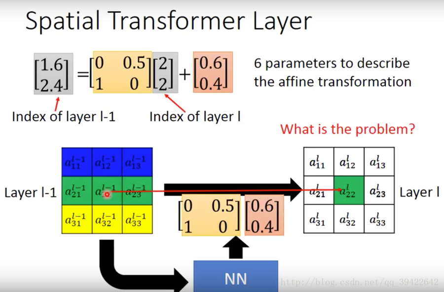

# Spatial Transformer Networks（STN）

展开

目录

1. STN的作用
   1.1 灵感来源
   1.2 什么是STN？
2. STN的基本架构
3. Localisation net是如何实现参数的选取的？
   3.1 实现平移
   3.2 实现缩放
   3.3 实现旋转
   3.4 实现剪切
   3.5 小结
4. Grid generator实现像素点坐标的对应关系
   4.1 为什么会有坐标的问题？
   4.2 仿射变换关系
5. Sampler实现坐标求解的可微性
   5.1 小数坐标问题的提出
   5.2 解决输出坐标为小数的问题
   5.3 Sampler的数学原理
6. Spatial Transformer Networks（STN)
7. STN 实现代码
8. reference

## 1.STN的作用

### 1.1 灵感来源

普通的CNN能够显示的学习平移不变性，以及隐式的学习旋转不变性，但attention model 告诉我们，与其让网络隐式的学习到某种能力，不如为网络设计一个显式的处理模块，专门处理以上的各种变换。因此，DeepMind就设计了Spatial Transformer Layer，简称STL来完成这样的功能。

### 1.2 什么是STN？

关于平移不变性 ，对于CNN来说，如果移动一张图片中的物体，那应该是不太一样的。假设物体在图像的左上角，我们做卷积，采样都不会改变特征的位置，糟糕的事情在我们把特征平滑后后接入了全连接层，而全连接层本身并不具备 平移不变性 的特征。但是 CNN 有一个采样层，假设某个物体移动了很小的范围，经过采样后，它的输出可能和没有移动的时候是一样的，这是 CNN 可以有**小范围的平移不变性** 的原因。

如图所示，如果是手写数字识别，图中只有一小块是数字，其他大部分地区都是黑色的，或者是小噪音。假如要识别，用Transformer Layer层来对图片数据进行旋转缩放，只取其中的一部分，放到之后然后经过CNN就能识别了。

我们发现，它其实也是一个layer，放在了CNN的前面，用来转换输入的图片数据，其实也可以转换feature map,因为feature map说白了就是浓缩的图片数据，所以Transformer layer也可以放到CNN里面。

## 2. STN的基本架构

如图是Spatial Transformer Networks的结构，主要的部分一共有三个，它们的功能和名称如下：

参数预测：Localisation net参数预测：Localisation net

坐标映射：Grid generator坐标映射：Grid generator

像素的采集：Sampler像素的采集：Sampler

为了让大家对这三个部分有一个先验知识，我先简单介绍一下。

如下图是完成的一个平移的功能，这其实就是Spatial Transformer Networks要做一个工作。

假设左边是$Layer l−1$的输出，也就是当前要做Transform的输入，最右边为Transform后的结果。这个过程是怎么得到的呢？

假设是一个全连接层，n,m代表输出的值在输出矩阵中的下标，输入的值通过权值w，做一个组合，完成这样的变换。

- 举个例子，假如要生成$a^l_{11}$,那就是将左边矩阵的九个输入元素，全部乘以一个权值，加权相加：

$$
a^l_{11}=w^l_{1111}a^{l-1}_{11}+w^l_{1112}a^{l-1}_{12}+w^l_{1113}a^{l-1}_{13}+……+w^l_{1133}a^{l-1}_{33}
$$

  这仅仅是$a^l_{11}$的值，其他的结果也是这样算出来的，用公式表示称如下这样：

通过调整这些权值，达到缩放，平移的目的，其实这就是Transformer的思想。

在这个过程中，我们需要面对三个主要的问题：

- 这些参数应该怎么确定？
- 图片的像素点可以当成坐标，在平移过程中怎么实现原图片与平移后图片的坐标映射关系？
- 参数调整过程中，权值一定不可能都是整数，那输出的坐标有可能是小数，但实际坐标都是整数的，如果实现小数与整数之间的连接？

其实定义的三个部分，就是专门为了解决这几个问题的，接下来我们一个一个看一下怎么解决。

## 3.Localisation net是如何实现参数的选取的？

### 3.1 实现平移

如果是平移变换，比如从$a^{l-1}_{11}$平移到$a^l_{21}$,得到$a^l_{21}$的表示为：
$$
a^l_{21}=w^l_{2111}a^{l-1}_{11}+w^l_{2112}a^{l-1}_{12}+w^l_{2113}a^{l-1}_{13}+……+w^l_{2 133}a^{l-1}_{33}
$$
我们可以令$w^l_{2111}=1$,其余均为0，不就得到了
$$
a^l_{21}=1*a^{l-1}_{11}
$$
这就完成了平移了吗？其他的平移也可以用类似的方法来做到。

你可能会问了，那我该怎么得到这些权值呢？总不能人工去看吧！
当然不会，我们可以设置一个叫做NN这类的东西，把$Layer l−1$的输出放到NN里，然后生成一系列w。这样听起来好玄乎，但确实是可以这么做的。

### 3.2 实现缩放

其实缩放也不难，如图所示，如果要把图放大来看，在$x→(X2)→x′,y→(X2)→y′$ 将其同时乘以2，就达到了放大的效果了，用矩阵表示如下：

缩小也是同样的原理，如果把这张图放到坐标轴来看，就是如图所示，加上偏执值0.5表示向右，向上同时移动0.5的距离，这就完成了缩小。

### 3.3 实现旋转

既然前面的平移和缩放都是通过权值来改的，那旋转其实也是。但是旋转应该用什么样的权值呢？
仔细思考，不难发现，旋转是跟角度有关系的，那什么跟角度有关系呢？
正弦余弦嘛，为什么它们能做旋转呢？
一个圆圈的角度是360度，可以通过控制水平和竖直两个方向，就能控制了，如图所示。

由点A旋转θθ度角，到达点B.得到
$$
x′=Rcosα \\ y′=Rsinα
$$
由A点得
$$
x=Rcos(α+θ) \\ y=Rsin(α+θ)
$$
展开，有：
$$
x=Rcosα cosθ−Rsinα sinθ \\ y=Rsinα cosθ+Rcosα sinθ
$$
把未知数$a$替换掉

$$
x=x′ cosθ−y′sinθ \\ y=y′cosθ+x′sinθ
$$
我们可以简单的理解为$cosθ,sinθ$就是控制这样的方向的，把它当成权值参数，写成矩阵形式，就完成了旋转操作。

注：如果想了解正余弦控制方向是怎么导出的，可以参考计算机图形学的相关书籍，一般都有介绍和数学公式的推导。

### 3.4 实现剪切

剪切变换相当于将图片沿x和y两个方向拉伸，且x方向拉伸长度与y有关，y方向拉伸长度与x有关，用矩阵形式表示前切变换如下：
$$
\left(\matrix{x'\\y'}\right)=\left(\matrix{1&m\\n&1}\right)\left(\matrix{x\\y}\right)
$$

### 3.5 小结

由此，我们发现所有的这些操作，只需要六个参数[2X3]控制就可以了，所以我们可以把feature map U作为输入，过连续若干层计算（如卷积、FC等），回归出参数θ，在我们的例子中就是一个[2，3]大小的6维仿射变换参数，用于下一步计算；

## 4.Grid generator实现像素点坐标的对应关系

### 4.1 为什么会有坐标的问题？

由上面的公式，可以发现，无论如何做旋转，缩放，平移，只用到六个参数就可以了，如图所示：

这6个参数，就足以完成我们需要的几个功能了。

而缩放的本质，其实就是在原样本上采样，拿到对应的像素点，通俗点说，就是输出的图片(i,j)的位置上，要对应输入图片的哪个位置？

如图所示旋转缩放操作，我们把像素点看成是坐标中的一个小方格，输入的图片$U∈R^{H_xW_xC}$可以是一张图片，或者feature map，其中H表示高，$W$表示宽，$C$表示颜色通道。经过变换$T_θ(G)$,$θ$是上一个部分（Localisation net）生成的参数，生成了图片$V∈R^{H′_xW′_xC}$V∈RH′xW′xC,它的像素相当于被贴在了图片的固定位置上，用$G=G_i$表示，像素点的位置可以表示为$G_i=\{x^t_i,y^t_i\}$这就是我们在这一阶段要确定的坐标。

### 4.2 仿射变换关系

因此定义了如图的一个坐标矩阵变换关系：

$(x^t_i,y^t_i)$是输出的目标图片的坐标，$(x^s_i,y^s_i)$是原图片的坐标，$A_θ$表示仿射关系。

但仔细一点，这有一个非常重要的知识点,千万别混淆，我们的坐标映射关系是：

**从目标图片→原图片**

**也就是说，坐标的映射关系是从目标图片映射到输入图片上的，为什么这样呢？**

作者在论文中写的比较模糊，比较满意的解释是坐标映射的作用，其实是让目标图片在原图片上采样，每次从原图片的不同坐标上采集像素到目标图片上，而且要把目标图片贴满，每次目标图片的坐标都要遍历一遍，是固定的，而采集的原图片的坐标是不固定的，因此用这样的映射。

举个自我感觉很贴切的小例子说一下吧。

- 如图所示，假设只有平移变换，这个过程就相当于一个拼图的过程，左图是一些像素点，右图是我们的目标，我们的目标是确定的，目标图的方框是确定的，图像也是确定的，这就是我们的目标，我们要从左边的小方块中拿一个小方块放在右边的空白方框上，因为一开始右边的方框是没有图的，只有坐标，为了确定拿过来的这个小方块应该放在哪里，我们需要遍历一遍右边这个方框的坐标，然后再决定应该放在哪个位置。所以每次从左边拿过来的方块是不固定的，而右边待填充的方框却是固定的，所以定义从

  **目标图片→原图片**

  的坐标映射关系更加合理，且方便。

## 5.Sampler实现坐标求解的可微性

### 5.1 小数坐标问题的提出

我们可以假设一下我们的权值矩阵的参数是如下这几个数，$x,y$分别是他们的下标，经过变换后，可以得到如下这样的对应。

前面举的例子中，权值都是整数，那得到的也必定是整数，如果不是整数呢？
如图所示：

假如权值是小数，拿得到的值也一定是小数，1.6,2.4，但是没有元素的下标索引是小数呀。那不然取最近吧，那就得到2，2了，也就是与$a^l_{22}$对应了。
那这样的方法能用梯度下降来解吗？

### 5.2 解决输出坐标为小数的问题

用上面的四舍五入显然是不能进行梯度下降来回传梯度的。
为什么呢？
梯度下降是一步一步调整的，而且调整的数值都比较小，哪怕权值参数有小范围的变化，虽然最后的输出也会有小范围的变化，比如一步迭代后，结果有：
$$
1.6→1.64,2.4→2.381.6→1.64,2.4→2.38
$$
但是即使有这样的改变，结果依然是：
$$
a^{l−1}_{22}→a^l_{22}
$$
的对应关系没有一点变化，所以output依然没有变，我们没有办法微分了，也就是梯度依然为0呀，梯度为0就没有可学习的空间呀。所以我们需要做一个小小的调整。

仔细思考一下这个问题是什么造成的，我们发现其实在推导SVM的时候，我们也遇到过相同的问题，当时我们如果只是记录那些出界的点的个数，好像也是不能求梯度的，当时我们是用了hing loss，来计算一下出界点到边界的距离，来优化那个距离的，我们这里也类似，我们可以计算一下到输出$[1.6,2.4]$附近的主要元素，如下所示，计算一下输出的结果与他们的下标的距离，可得：

然后做如下更改：

他们对应的权值都是与结果对应的距离相关的，如果目标图片发生了小范围的变化，这个式子也是可以捕捉到这样的变化的，这样就能用梯度下降法来优化了。

### 5.3 Sampler的数学原理

论文作者对我们前面的过程给出了非常严密的证明过程，以下是我对论文的转述。

每次变换，相当于从原图片$(x^s_i,y^s_{i})$中，经过仿射变换，确定目标图片的像素点坐标$(x^t_i,y^t_{i})$的过程,这个过程可以用公式表示为：

（注：把一张图片展开，相当于把矩阵变成坐标向量）
kernel k表示一种线性插值方法，比如双线性插值，更详细的请参考：[（线性插值，双线性插值Bilinear Interpolation算法）](http://blog.csdn.net/xbinworld/article/details/65660665)，$ϕx,ϕy,$表示插值函数的参数；$U^c_{nm}$表示位于颜色通道$c$中坐标为$(n,m)$的值。

如果使用双线性插值，可以有：

为了允许反向传播回传损失，我们可以求对该函数求偏导：

对于$y^s_i$的偏导也类似。

如果就能实现这一步的梯度计算，而对于$\frac{∂x^s_i}{∂θ},\frac{∂y^s_i}{∂θ}$的求解也很简单，所以整个过程

**Localisation net←Grid generator←Sampler**

的梯度回转就能走通了。

## 6.Spatial Transformer Networks（STN)

将这三个组块结合起来，就构成了完整STN网络结构了。

这个网络可以加入到CNN的任意位置，而且相应的计算量也很少。

将 spatial transformers 模块集成到 cnn 网络中，允许网络自动地学习如何进行 feature
map 的转变，从而有助于降低网络训练中整体的代价。定位网络中输出的值，指明了如何对
每个训练数据进行转化。

## 7.STN 实现代码

相应的代码已经有人实现了，我就不做重复工作了。
请参考：[Spatial Transformer Networks](http://kekecv.com/resource/stnet_report_2015.pdf)
[Torch code](https://github.com/qassemoquab/stnbhwd)
[Theano code](https://github.com/skaae/transformer_network)

## 8.reference

[原论文](https://arxiv.org/pdf/1506.02025.pdf)
[Spatial Transformer](http://speech.ee.ntu.edu.tw/~tlkagk/courses/MLDS_2017/Lecture/Special%20Structure%20%28v6%29.pdf)
[Spatial Transformer Networks](http://kekecv.com/resource/stnet_report_2015.pdf)
[卷积神经网络结构变化——Spatial Transformer Networks](http://blog.csdn.net/xbinworld/article/details/69049680)
[三十分钟理解：线性插值，双线性插值Bilinear Interpolation算法](http://blog.csdn.net/xbinworld/article/details/65660665)
[Spatial Transformer Networks 笔记](http://www.paperweekly.site/papers/notes/2)
李宏毅老师的视频讲解